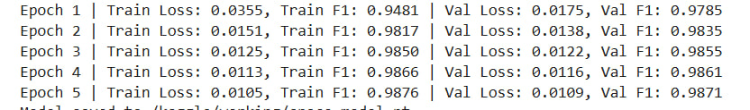
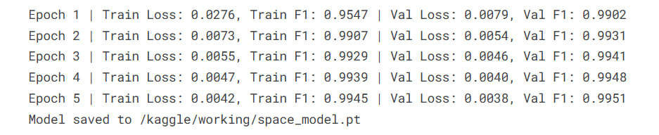

# Отчет

## Суть задачи

У нас есть строка вида:

`книгавхорошемсостоянии`

Нужно восстановить:

`книга в хорошем состоянии`

То есть: поставить пробелы в правильных местах.

## Данные

Небольшое EDA по данным, которые нам предоставили в качестве тестовой выборки, выполнен в `src/test_data_eda.ipynb`

**Основные выводы**:
- Тексты на русском языке
- Тексты небольшой длины
- Тексты полностью без пробелов (нужно полное восстановление пробелов, а не частичное)

Для того, чтобы добиться наилучших результатов на домене наших данных, для датасета нужно собрать:
- Общие тексты на различные тематики
- Тексты, соотносящиеся с доменом наших текстовых данных, т.е. отзывы пользователей, поисковые запросы, в которых появлялись бы имена брендов и т.д.

### Датасет

Соберем различные тексты и получим колонки в нашем датасете:
- Исходный текст
- Текст полностью без пробелов

Будем учить модель из текстов без пробелов восстанавливать исходный текст.
Т.к. в тестовых данных нет частично утраченных пробелов, а они полностью удалены, можно полностью удалять пробелы, кажется, это не должно ухудшать метрики.

## Подход

Будем решать задачу дискриминативным методом, а именно - делать бинарную классификацию токенов, после которых нужно ставить пробел.
Т.е. - Token Binary Classification

Например, у нас есть токены:

[кни, га, в, хоро, шем, состоя, нии]

Тогда лейблы для токенов будут:

[0, 1, 1, 0, 1, 0, 0]

### Pretrained tokenizer + BiLSTM Classifier

Идея: использовать уже предобученный токенизатор, чтобы использовать его уже выученную информацию о имеющихся структурных единицах текстов

Итоговая метрика f1: 0.61

Модель:
embedding_size = 128
hidden_dim = 128
num_layers = 1

Проблема: токенизатор часто склеивает границы слов в один токен, что не дает модели и исходным данным возможность хоть как-то улучшить метрики
Например:
- Текст: книгавхорошемсостоянии -> книга в хорошем состоянии
- Токены: [кни, гав, хорош, емсос, тоянии]

Использовании других предобученных токенизаторов кроме BPE (SentecePiece, которые не обрезали изначальные пробелы) не очень помогло.

### CharBasedTokenizer + BiLSTM Classifier

Идея: использовать самую базовую токенизацию - посимвольно. Тогда проблемы с token alignment не будет

Модель:
embedding_size = 128
hidden_dim = 128
num_layers = 1

Итоговая метрика f1: 0.71

Проблема: все еще низкая метрика и неулавливание контекста, модель не знает о словах, которые используются в тесте

### CharBasedTokenizer + BiLSTM Classifier (general dataset)

Идея: поменяем датасет на более общий, чтобы модель больше узнала об языке и отдельных структурных единицах

Модель:
embedding_size = 128
hidden_dim = 128
num_layers = 1

Итоговая метрика f1: 0.86

Проблема: отдельные слова модель все еще ну улавливает, например, названия брендов

### CharBasedTokenizer + BiLSTM Classifier (bigger dataset, bigger model)

Идея: добавим в датасет более релевантных данных, таких как: отзывы на товары, в которых может содержаться информация, похожая на тестовые. Как следствие, увеличив датасет, увечилим и количество параметров модели, также добавив регуляриацию, чтобы избежать переобучения. Также уменьшим embedding_size, т.к. количество символов, которые мы на самом деле используем, ~100, значит, нам не нужно слишком много информации, чтобы описать сами токены отдельно.

Модель:
embedding_size = 64
hidden_dim = 128
num_layers = 3
dropout = 0.2

Итоговая метрика f1: 0.93

Проблема: все еще иногда ошибается на редких словах

